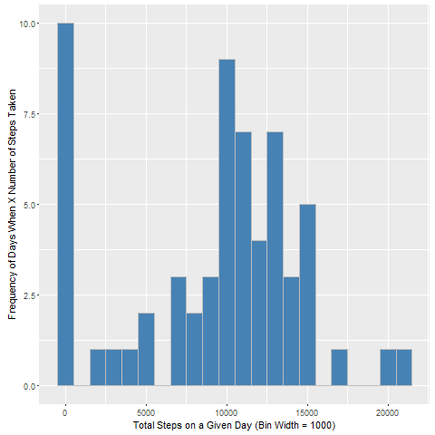
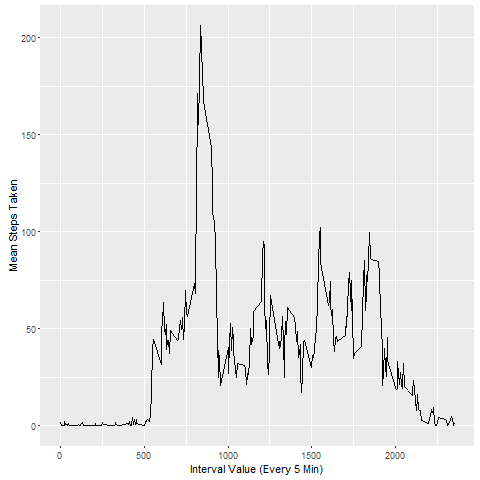
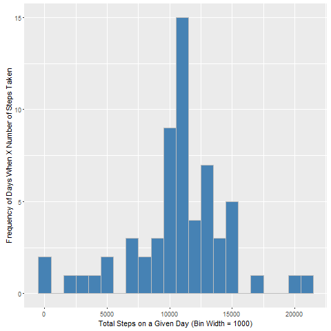
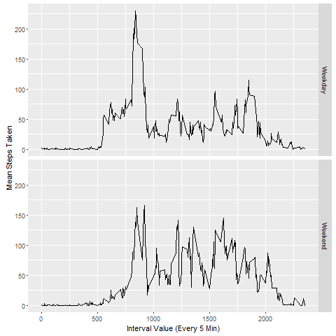

Reproducible Research: Project 1
====================================

## Introduction
The purpose of this project is to familiarize students with the knitr and r markdown language to produce data analytical documents. The analysis below will summarize the analysis of FitBit data on people's step trends.

## Data
Data Source: 
https://d396qusza40orc.cloudfront.net/repdata%2Fdata%2Factivity.zip

 - **steps:** Number of steps made within a 5 min interval
 - **date:** The date in which the measurement was taken
 - **interval:** The iteration of the 5 min interval


### 1) Code for reading in the dataset and/or processing the data
Download the zip file and read into a dataframe

```{r}

if(!file.exists('activity.csv')){
    unzip('activity.zip')
}
activityData <- read.csv('activity.csv')

```

### 2) Histogram of the total number of steps taken each day
Utilizes ggplot to chart a histogram of the frequency of days in which different ranges in steps were taken that day. NA values removed.

```{r warning = FALSE}
library(ggplot2)

totalSteps <- tapply(activityData$steps, activityData$date, sum, na.rm=TRUE)
qplot(totalSteps, xlab='Total Steps on a Given Day (Bin Width = 1000)', ylab='Frequency of Days When X Number of Steps Taken', binwidth=1000, fill = I("steelblue"), col = I("grey"))
```
 

### 3) Mean and median number of steps taken each day
Display the mean and median values when NA values removed
```{r}
stepsMean <- mean(totalSteps)
stepsMean
stepsMedian <- median(totalSteps)
stepsMedian 
```

### 4) Time series plot of the average number of steps taken
A linear time series plot to show the average amounts of steps individuals took during certain intervals.

```{r}
averageSteps <- aggregate(x=list(meanSteps=activityData$steps), by=list(interval=activityData$interval), FUN=mean, na.rm=TRUE)
ggplot(data=averageSteps, aes(x=interval, y=meanSteps)) +
    geom_line() +
    xlab("Interval Value (Every 5 Min)") +
    ylab("Mean Steps Taken") 
```


### 5) The 5-minute interval that, on average, contains the maximum number of steps
The interval value which the highest steps were recorded on average
```{r}
maxStepsRowNum <- which.max(averageSteps$meanSteps)
intervalMaxSteps <- averageSteps[maxStepsRowNum,'interval']
intervalMaxSteps
```


### 6) Code to describe and show a strategy for imputing missing dataset
First determine how many null data values exist in the data set
```{r}
nullData <- is.na(activityData$steps)
table(nullData)
```

Assuming these null values are non-zero values and that individuals do take steps at these intervals, the safest value to input into these missing fields would be the average step count found at each interval. Code below makes a copy data frame and inputs null values with average step values captured at each interval.

```{r}
activityDataFilled <- activityData
for (i in 1:nrow(activityDataFilled))
{
        if (is.na(activityDataFilled[i,"steps"])==TRUE)
            {
                    activityDataFilled[i,"steps"] <- averageSteps[which(averageSteps$interval == activityDataFilled[i,"interval"]),'meanSteps']
            } 
}
```


### 7) Histogram of the total number of steps taken each day after missing values are imputed
New histogram with null values replaced with averages displayed below.

```{r}
totalSteps <- tapply(activityDataFilled$steps, activityDataFilled$date, sum, na.rm=TRUE)
qplot(totalSteps, xlab='Total Steps on a Given Day (Bin Width = 1000)', ylab='Frequency of Days When X Number of Steps Taken', binwidth=1000, fill = I("steelblue"), col = I("grey"))

stepsMean <- mean(totalSteps)
stepsMean
stepsMedian <- median(totalSteps)
stepsMedian
```


### 8) Panel plot comparing the average number of steps taken per 5-minute interval across weekdays and weekends
A new column to indicate whether a day was on a weekday or weekend needs to be added.

```{r}
weekends <- c("Saturday", "Sunday")
activityDataFilled$dateType = as.factor(ifelse(is.element(weekdays(as.Date(activityDataFilled$date)),weekends), "Weekend", "Weekday"))
```
Linear plot of step trends shows the distribution of when steps were taken Weekdays vs Weekends.
```{r}
averageStepsFilledDate <- aggregate(steps ~ interval + dateType, data=activityDataFilled, mean)
ggplot(averageStepsFilledDate, aes(interval, steps)) + 
    geom_line() + 
    facet_grid(dateType ~ .) +
    xlab("Interval Value (Every 5 Min)")  + 
    ylab("Mean Steps Taken") 

```
 
